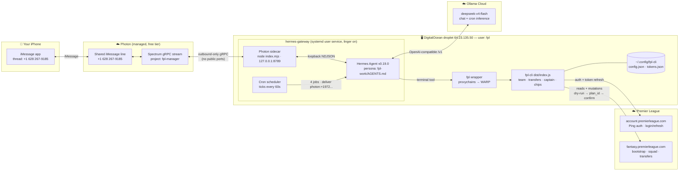

# Architecture

## Cron jobs (CDT)

| Job | Schedule | What it does |
|---|---|---|
| `gw-deadline-check` | daily 18:00 | Countdown + flagged players + ONE recommendation if deadline < 48h |
| `price-watch` | daily 07:30 | Price movers on your squad/targets (silent if none) |
| `injury-scan` | daily 08:00 | New squad injuries + top replacement (silent if clean) |
| `gw-review` | Tue 09:00 | Post-GW points/rank/lesson summary |

## Trust & safety boundaries

- **No inbound ports** — droplet firewall allows SSH only; Photon is a persistent *outbound* gRPC stream.
- **Pairing gate** — only your number (`+19728226226`) can talk to the agent.
- **Mutation policy** — every transfer/captain/chip requires `fpl` dry-run → `plan_id` → your explicit iMessage "yes" before `--confirm`. Cron jobs are read-only.
- **WARP egress** — FPL's auth provider 429-blocks the droplet's DO IP, so all `fpl` traffic exits via Cloudflare WARP.
